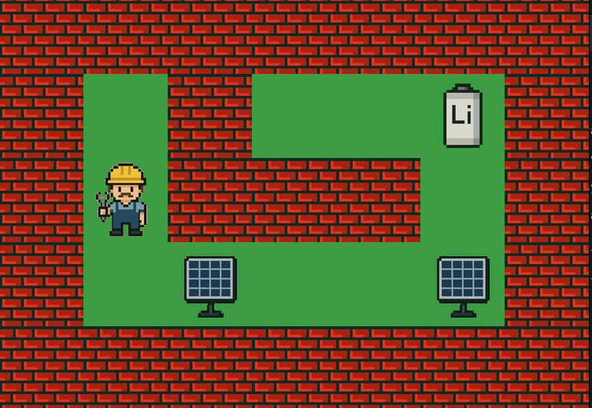

# simple_2D_game

this repository hold the a simple 2D game done using the C programming language and the mlx library

to run it go to this link https://github.com/42paris/minilibx-linux and clone the mlx library into the game file,

make, then run ./game  maps/[whatever map you want]

You can even create the map you want as long as you follow the rules:

1-the map must be enclosed with 1s

2-the map must be rectangular

3-the map must be playable, so the player must be able to reach all collectibles and the end
